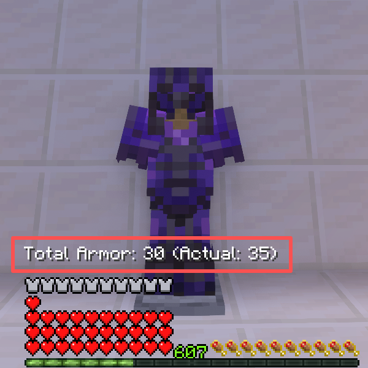

# 护甲显示

[English](README.md) | **简体中文**



一个适用于 **Minecraft 1.21.4** 的 **客户端** [Fabric](https://fabricmc.net/) 模组，在 HUD 护甲栏上方显示你的**护甲数值**。

适用于任何护甲数值与原版不同的服务器，包括 **RPG 服务器**、**自定义装备服务器**，以及任何通过**插件**或**数据包**修改护甲属性的服务器。

## 功能

- 在 HUD 护甲栏上方显示**护甲总数值**
- 当护甲超过**原版上限 30** 时，显示 `30 (实际: X)` 以同时反映有效值和真实值
- 读取**服务器同步的护甲属性**（如插件或装备系统附加的护甲加成）
- 自动适配**多行血量条**和**吸收之心**的位置
- 可配置**文字颜色**（白色 / 黄色 / 青色 / 绿色）
- 支持在游戏中**开启/关闭**显示
- 可**自定义**配置菜单快捷键（默认：`N`）

## 环境要求

- Minecraft **1.21.4**
- Fabric Loader ≥ 0.16.0
- Fabric API

## 使用方法

按 `N`（默认）打开设置菜单。

## 构建

```bash
./gradlew build
```

输出 jar 位于 `build/libs/`。

## 许可证

MIT — by averatec0773
